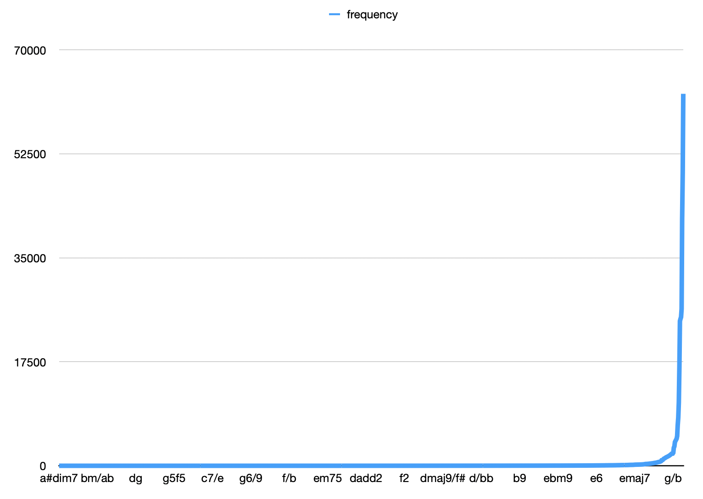

# Token extract

within this project I am writing the code to extract individual chords from song documents.

Since there is a lot of variation in human curated content and, suprisingly, thousands of chords,
this is proving to be a bit of challenge.

## Current solution:

The solution to gather data shaped itself incrementally and, while increasingly getting better, we deal with data of high variety and won't aim for perfection here.

### Step 1
we have a document of thousands of chord documents, concatenated.

by simply going over all lines I filtered which had a high likelyhood
of being compromised of chordshapes, discriminating by their whitespace to non whitespace ratio.

E.g.

```
    Em       A
this is a line of lyrics
```

the line with lots of whitespace was compromised of chords!

This worked poorly and yielded lots of false positives.

after splitting the remaining lines by whitespace
tens of thousands of tokens were extracted. Often words like "and" came up, and many suprising things showed as tokens.
Furthermore, there were thousands of true positives of chords, the amount took me by suprise.

### Step 2

After manual cleanup, I had a set of chords, and now I went over all lines again.

For each line I tokenzied it by splitting whitespace, and if more than 50% of the tokens were in our previously curated set,
the entire line is assumed to be made of chords.

This allows to generalize even to allow chords not in our curated list!

### Step 3

Still there was a lot of noise in our input data set.
I skimmed through the thousands of output tokens and manually identified errors.

Some I decided to fix, such as descriptions of chords:

g 310033
d xx0232

a list of common words that came up was created:

  stop for free fill guitar etc fret yeah you your with til oh faster repeat break bridge chorus coda instrumental int interlude intro let outro solo verse mute until hit note on string each and then play tuned half step down barre riff open single strum walk to low high once bend hold pause

and just various adjustments were made, some rather unintuitive.

I ended up with a list of over a thousand tokens.

See `token-frequency.csv`

### Step 4

I created a tool to analyse the frequeny of my token set.
Since I couldn't create a perfect tokenisation and filtering scheme, I decided I would just through out rarely occuring words.
This way I wouldn't have to filter out tokens such as `a mullato` manually. You may be able to guess the song which this problem occured from.

This also lends itself to a data driven processing further down the line, which is expected to yield poor results on rarely seen data.

Here's a graph of the frequency of tokens:



I think I will end up just cutting of the tokens and remain with a set of 256 chords.
- All tokens that are not in that set will be simplified (e.g. Em7 => Em) and if they are not in the set after basic simpification, just discarded.

### Step 5

TODO simplify chords

### Step 6

TODO end of song or start of song token
